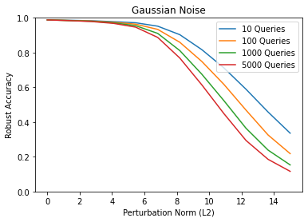
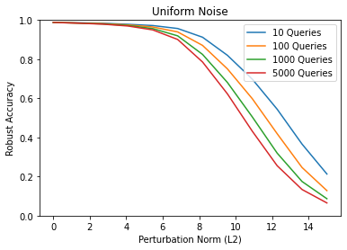

# Adversarial-ML

## Random Attack on MNIST

### MNIST

Robustness accuracy vs perturbation norm for different number of total queries

As expected, the accuracy decrease consistently with increase in norm and increase in queries.

Note, that the true norm difference between original image and adversarial image would be slightly smaller than the perturbation norm since the pixels are clipped in [0, 1] after adding the noise so that the input to the model remain a valid image. 