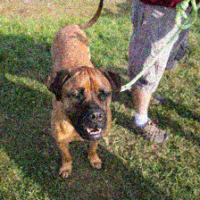
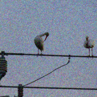
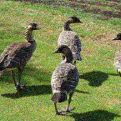

# Adversarial-ML

## Random Attack on MNIST and ImageNet (Resnet18)

### MNIST

Some successful adversarial attacks (19/100) with over one million attacks

Average $l_2$ distance between the original image and adversarial image here is 4.5

 |

](./Results/mnist/3.png?raw=True)| |](./Results/mnist/5.png?raw=True)

### ImageNet

Some successful adversarial attacks (5/20) with just 10k attacks

||| 

Average $l_2$ distance between the original image and adversarial image here is 20