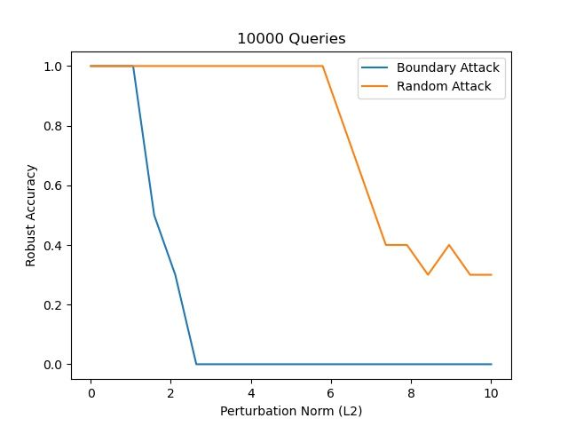

# Adversarial-ML

## Random Attack on MNIST

### MNIST

Robustness accuracy vs perturbation norm for different number of total queries

| |

As expected, the accuracy decrease consistently with increase in norm and increase in queries. The average norm of the input is roughly 8 ($l_2$) and 1 ($l_\infty$).

While the average minimum perturbation norm is roughly 2 ($l_2$) and 0.2 ($l_\infty$) using DeepFool

Note, that the true norm difference between original image and adversarial image would be slightly smaller than the perturbation norm since the pixels are clipped in [0, 1] after adding the noise so that the input to the model remain a valid image. 

### Boundary Attack vs Random Attack

